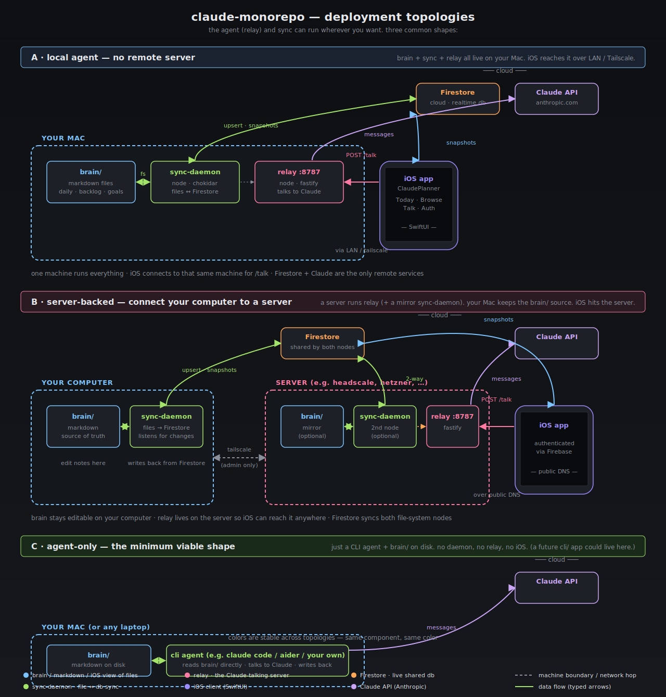

# claude-monorepo

<p align="center">
  
</p>

Single source of truth for the **Brain ↔ ClaudePlanner** system. Four apps live here, plus shared docs.

```
claude-monorepo/
├── apps/
│   ├── brain/          # second-brain markdown notes (source-of-truth content)
│   ├── sync-daemon/    # Node: watches brain/ and pushes to Firebase
│   ├── relay/          # Node: Fastify server, bridges iOS ↔ Claude API ↔ Firebase
│   ├── ios-app/        # SwiftUI: ClaudePlanner iOS client
│   └── server/         # PLACEHOLDER — remote claudeplanner server (see docs/ARCHITECTURE.md)
├── docs/
│   ├── ARCHITECTURE.md # components, data flow, file maps, deps — start here
│   ├── codemaps/       # per-app file inventories
│   └── personal.md     # carried over from ClaudePlanner
├── CLAUDE.md           # original ClaudePlanner agent instructions
└── README.md
```

## Quickstart per app

| App           | Setup                                  | Run                              |
| ------------- | -------------------------------------- | -------------------------------- |
| `brain`       | (markdown — no build)                  | edit files directly              |
| `sync-daemon` | `cd apps/sync-daemon && npm install`   | `npm start`                      |
| `relay`       | `cd apps/relay && npm install`         | `npm run dev`                    |
| `ios-app`     | `apps/ios-app/bootstrap.sh && open apps/ios-app/ClaudePlanner.xcodeproj` | build in Xcode |
| `server`      | not yet imported                       | see docs/ARCHITECTURE.md         |

Or, from the monorepo root:

```bash
make install   # npm install in all node apps
make dev       # start sync-daemon + relay in parallel
make ios       # bootstrap + open the Xcode project
make lint      # lint all node apps
```

## Documentation

| doc                                          | what's in it                                     |
| -------------------------------------------- | ------------------------------------------------ |
| [`docs/ARCHITECTURE.md`](docs/ARCHITECTURE.md) | components, data flow, sequence diagram, deps   |
| [`docs/codemaps/brain.md`](docs/codemaps/brain.md)             | brain/ file map + conventions          |
| [`docs/codemaps/relay.md`](docs/codemaps/relay.md)             | relay file map, tools, env             |
| [`docs/codemaps/sync-daemon.md`](docs/codemaps/sync-daemon.md) | daemon file map + Firestore schema     |
| [`docs/codemaps/ios-app.md`](docs/codemaps/ios-app.md)         | iOS surface map + key types            |
| [`CLAUDE.md`](CLAUDE.md)                     | original agent instructions for the project      |

## Data flow at a glance

```
  ┌────────────┐    chokidar      ┌────────────┐   firestore   ┌──────────┐
  │  brain/    │ ───────────────► │ sync-daemon│ ────────────► │ Firebase │
  │ (md files) │                  └────────────┘               └────┬─────┘
  └────────────┘                                                    │
                                                                    │ realtime
                                                                    ▼
                                                              ┌──────────┐
       Claude API ◄──── @anthropic ◄──── relay (fastify) ◄────│  iOS app │
                                                              └──────────┘
```

Read `docs/ARCHITECTURE.md` for the detail behind that diagram, including per-app file inventories and dependency lists.

## Originals

This monorepo was assembled from these existing repos — they are **preserved**, not deleted:
- `~/projects/brain` (the Brain second-brain scaffold)
- `~/projects/ClaudePlanner` (ios-app + relay + sync-daemon)

The remote claudeplanner server still lives on its host (TBD location) — see ARCHITECTURE.md for the import plan.
