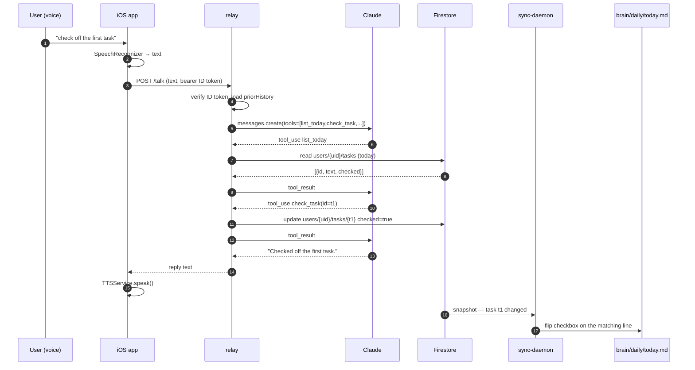
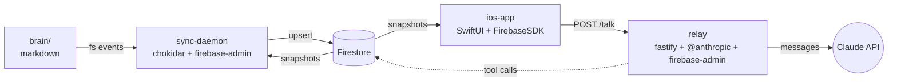

# Architecture


## In one paragraph

Your **brain/** directory of markdown files is the source of truth. The **sync-daemon** runs locally and shadows it to **Firestore** in real time; Firestore also writes back to disk, so edits from the iOS app land in `brain/`. The **iOS app** is a SwiftUI client that reads Firestore directly for files & today's tasks, and routes voice/text messages to the **relay**. The **relay** is a Fastify server that wraps the Anthropic Messages API with a small toolset (`list_today`, `check_task`, `read_file`, …) that operates on Firestore — so when Claude says "check off the first task", it does, and the change propagates back through Firestore → sync-daemon → `brain/daily/today.md`.

```
brain/  ──fs events──►  sync-daemon  ──upsert──►  Firestore  ◄──snapshots──  iOS app
                                       ◄──tools──  relay  ◄──/talk──        │
                                                     │                       │
                                                     └────messages───►  Claude API
```

## Components

### apps/brain/ — the planner content

Plain markdown, structured by purpose:

| folder        | what's inside                                           |
| ------------- | ------------------------------------------------------- |
| `daily/`      | `today.md` (live task list, checkbox per line)          |
| `backlog/`    | `tasks.md` (unscheduled), `upcoming.md` (deadlines), `someday.md` |
| `goals/`      | `this-week.md`, longer-term goal docs                   |
| `projects/`   | per-project `overview.md`                               |
| `routines/`   | recurring patterns / templates                          |
| `notes/`      | freeform notes                                          |
| `archive/`    | retired files                                           |
| `templates/`  | scaffolds for new files                                 |

The relay's system prompt (`apps/relay/src/claude.js`) hard-codes these paths — Claude is told "today's tasks are in daily/today.md, backlog is in backlog/upcoming.md, …". Don't rename folders without updating that prompt.

### apps/sync-daemon/ — file ↔ Firestore bridge

A long-running Node process. Two halves:

1. **Filesystem watcher** (`src/watcher.js` + `src/sync.js`): chokidar watches `brain/` for `*.md` changes, parses the file with `src/parsers/`, and upserts metadata + extracted tasks into Firestore.
2. **Firestore watcher** (`src/firestore-watcher.js`): listens to two collections.
   - **Task-level**: when a task in `today.md` is toggled from the phone, flip the Nth checkbox in place on disk.
   - **File-level**: if Firestore has newer `raw` content than disk (e.g. another sync node wrote it), overwrite the file. This makes the daemon safe to run on multiple machines.
3. **Loop protection**: writes flag a per-file mtime in memory so the FS watcher ignores its own writes for a short window.

Config lives in `apps/sync-daemon/config.js`; credentials come from one of `FIREBASE_SERVICE_ACCOUNT_JSON`, `GOOGLE_SERVICE_ACCOUNT_JSON`, `GOOGLE_APPLICATION_CREDENTIALS`, or the fallback `~/.config/brain-sync/service-account.json`.

See [`codemaps/sync-daemon.md`](codemaps/sync-daemon.md) for the full file map.

### apps/relay/ — Claude tool-use server

Fastify on `127.0.0.1:8787` (configurable). Single endpoint: `POST /talk`. Auth = Firebase ID token (bearer), and the UID must be in `ALLOWED_UIDS`.

Files (full map: [`codemaps/relay.md`](codemaps/relay.md)):

- `src/index.js` — server bootstrap, auth middleware, `/talk` route.
- `src/claude.js` — `runClaude({ apiKey, transcript, priorHistory, tools, onToolCall })` — the tool-use loop. Hard-coded model `claude-opus-4-7`, `MAX_TOOL_ROUNDS = 6`.
- `src/tools.js` — tool schemas (`list_today`, `check_task`, `read_file`, …) and their Firestore-backed implementations.
- `src/firebase.js` — Admin SDK init.

The system prompt enforces brevity ("Two sentences max unless the user asks for more").

### apps/ios-app/ — SwiftUI client

Xcode project at `apps/ios-app/ClaudePlanner.xcodeproj`. Three main surfaces:

| surface     | files                                                  |
| ----------- | ------------------------------------------------------ |
| **Today**   | `Today/TodayView.swift`, `EditTaskSheet.swift`         |
| **Browse**  | `Browse/BrowseView.swift`, `FileDetailView.swift`      |
| **Talk**    | `Talk/TalkView.swift`, `TalkToClaudeIntent.swift` (AppIntent — Siri / Action Button), `SpeechRecognizer.swift`, `TTSService.swift`, `ClaudeClient.swift` (HTTP client for relay) |

State containers (`Services/FilesStore`, `Services/TodayStore`) subscribe to Firestore snapshots. Auth handled in `Auth/AuthService.swift` (Firebase Auth, Sign-in-with-Apple expected per `*.entitlements`).

See [`codemaps/ios-app.md`](codemaps/ios-app.md).

### Remote claudeplanner server — NOT YET IMPORTED

Searched `headscale` (root@headscale) at depth 5 across `/`, `/opt`, `/srv`, `/root`, `/home`, `/var/www`, and `/etc/systemd/system`. **No claudeplanner code is currently deployed there.** What's on headscale:

- `/root/brain/` — empty placeholder dir (not a git repo)
- `/root/servarr/`, `/root/headplane/` — unrelated services with docker-compose
- No Node/Python services matching the pattern

If a remote relay/sync-daemon instance exists on a different host, add it under `apps/server/` and update this section. The local `apps/relay/` already runs a full server; "remote" was likely shorthand for "deploy it to headscale".

## Sequence — "check off the first task" via voice



## Dependency graph



### Node deps (relay)

```json
{
  "@anthropic-ai/sdk": "^0.30.0",
  "fastify":           "^5.0.0",
  "firebase-admin":    "^12.7.0"
}
```

### Node deps (sync-daemon)

```json
{
  "chokidar":       "^3.6.0",
  "firebase-admin": "^12.7.0"
}
```

### iOS deps

Resolved via SwiftPM (`Package.resolved` present). FirebaseSDK is the only first-party iOS dep; everything else is system frameworks (Speech, AVFoundation, AppIntents, etc.).

## Environment & secrets

| var                                | who reads it       | what for                                  |
| ---------------------------------- | ------------------ | ----------------------------------------- |
| `ANTHROPIC_API_KEY`                | relay              | Claude Messages API                       |
| `ANTHROPIC_MODEL` *(opt)*          | relay              | override `claude-opus-4-7`                |
| `ALLOWED_UIDS`                     | relay              | comma-sep allowlist of Firebase UIDs      |
| `HOST` / `PORT` *(opt)*            | relay              | bind (default `127.0.0.1:8787`)           |
| `GOOGLE_APPLICATION_CREDENTIALS`   | relay, sync-daemon | path to Firebase service-account JSON     |
| `FIREBASE_SERVICE_ACCOUNT_JSON`    | sync-daemon        | service-account JSON inline (no file)     |

Service-account JSON files match the gitignore patterns (`service-account*.json`, `*-credentials.json`) — never commit them.

## Operational notes

- **The relay must run on a machine the iOS app can reach.** Locally that's the dev Mac (Tailscale / Ngrok / `expo dev` style); for production, deploy to headscale (or any Tailscale node) and have the iOS app talk to that hostname.
- **The sync-daemon should run wherever `brain/` lives.** It can run on multiple nodes; loop-protection makes that safe.
- **Truth is markdown.** If Firestore and a file disagree, prefer the file unless `firestore-watcher.js` says Firestore is newer (which is what makes cross-device editing work).
